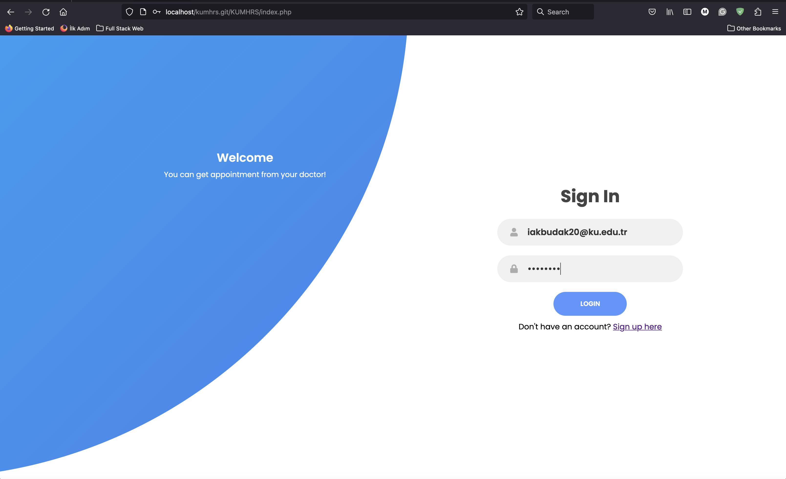
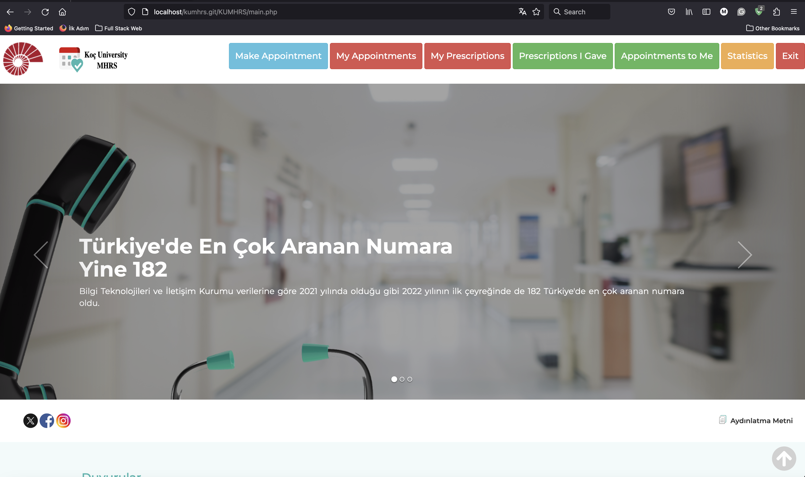
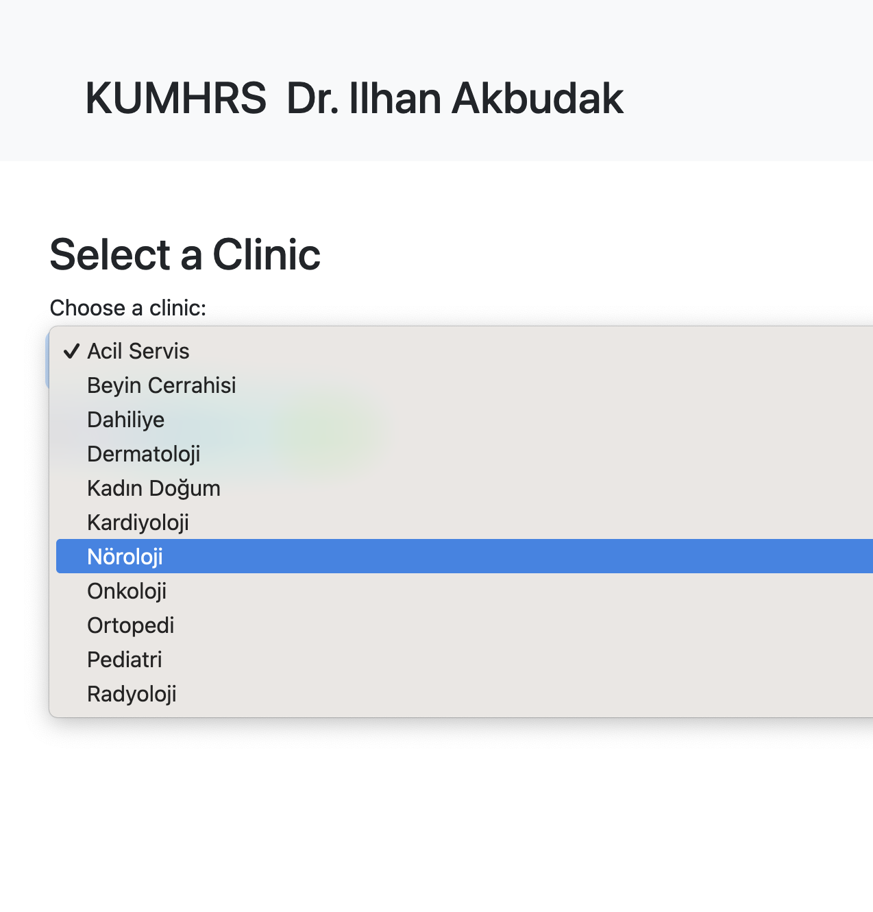
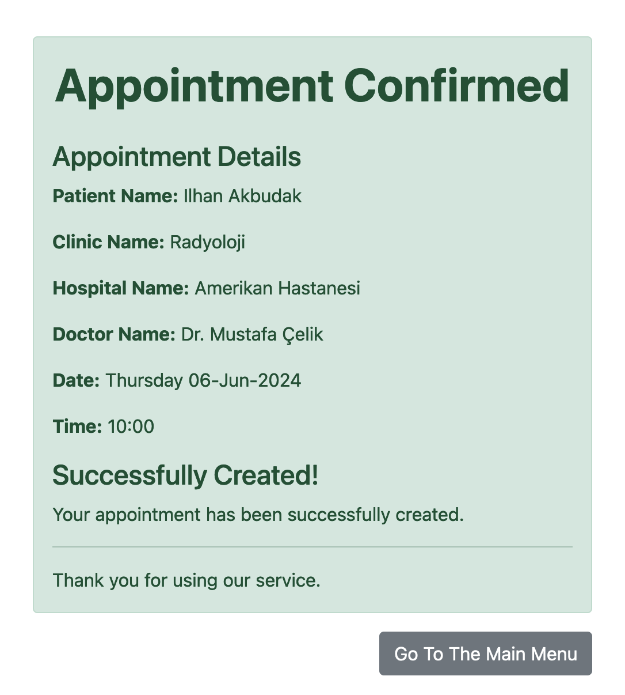

# KUCDAS - Koç University Central Doctor Appointment System

## Description

KUCDAS is a medical appointment website developed as a group project for COMP306 to enhance Database Management skills. This platform facilitates the management of medical appointments, prescriptions, and user statistics in a streamlined and efficient manner.

## Note

- **Educational Purpose:** This website has been developed solely for educational purposes within the framework of a COMP306 course project and is not intended for commercial use.
- **UI Design:** The main page UI (main.php) is inspired by and closely resembles the design found on [MHRS www.mhrs.gov.tr](http://www.mhrs.gov.tr). All other features, including additional UI elements and database queries, have been independently developed by our team.
- **Imaginary Data:** All names of patients and doctors are fictitiously generated. Any resemblance to real persons, living or dead, is purely coincidental and unintentional.
- **Hospital Names:** The names of hospitals used within this project are either entirely fictional or are actual institutions, mentioned purely for the purposes of context within the educational scope of the project.


## Features

- **User Authentication:** Separate login portals for general users and doctors.
- **Account Registration:** Distinct signup processes tailored for general users and doctors.
- **Appointment Management:** Book appointments with specific doctors and view your upcoming appointments.
- **Prescription Management:** Doctors can write and track prescriptions. Patients can view prescription details.
- **Statistical Insights:** Access personal and general statistics related to medical appointments and services.

## Screenshots

Here are some visuals of the KUCDAS in action:







## Installation

Follow these steps to get KUCDAS up and running on your local machine:

1. **Clone the repository:**
   ```bash
   git clone https://github.com/KUCDAS/KUMHRS.git


2. Set up a local server:
   - Download and install XAMPP from [here](https://www.apachefriends.org/)
   - Start the Apache and MySQL servers via the XAMPP control panel.
3. Database Setup:
   - Import the data.sql file into your MySQL database to set up the necessary tables and data.
4. Access the Application:
   - Open your web browser and navigate to:
    ```url
    localhost/KUMHRS/
    
